## Overview

Azure Logic Apps, helps in creating and running automated workflows

- No coding is required
- It has
  - Triggers
  - Actions

## How to create a Logic Apps

- Choose Hosting Option : Consuption
  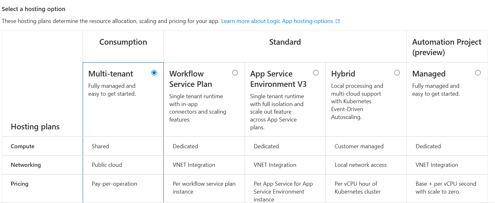

**Project Details**

- Subscription
  - Resource Group

**Instance Details**

- Logic App Name :
- Region :
- Enable Log Analytics : Disabled (Default)
- Workflow Type : Stateful
  - Stateful

**Tags**

- Name/Value

## How to create a workflow in Azure Logic Apps

- Go to the workflow designer
  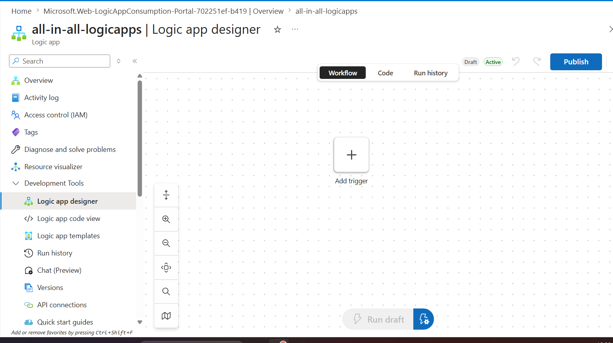

- Add a trigger : From an App -> Blob Storage
  - Trigger Types
    - HTTP
    - Schedule
    - From an app
      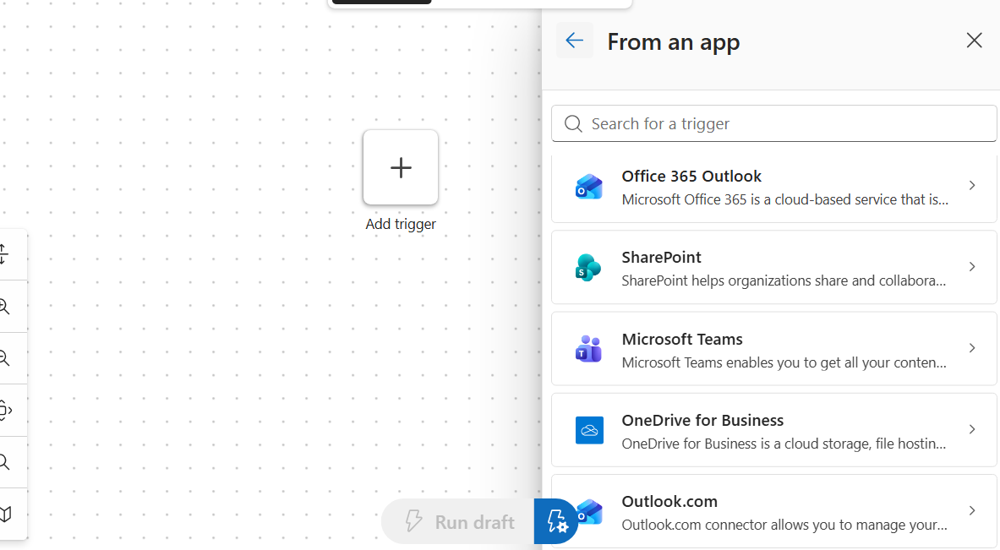
    - From Azure
      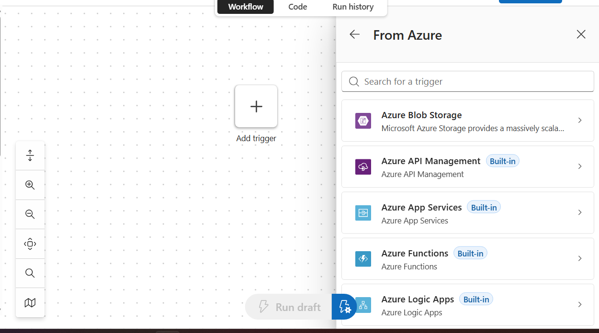
    - From another workflow
      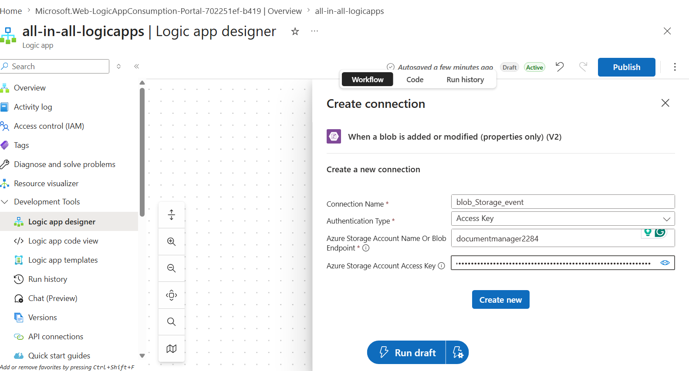
      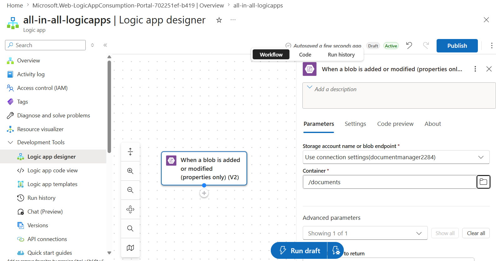
- Add Action : Outlook
  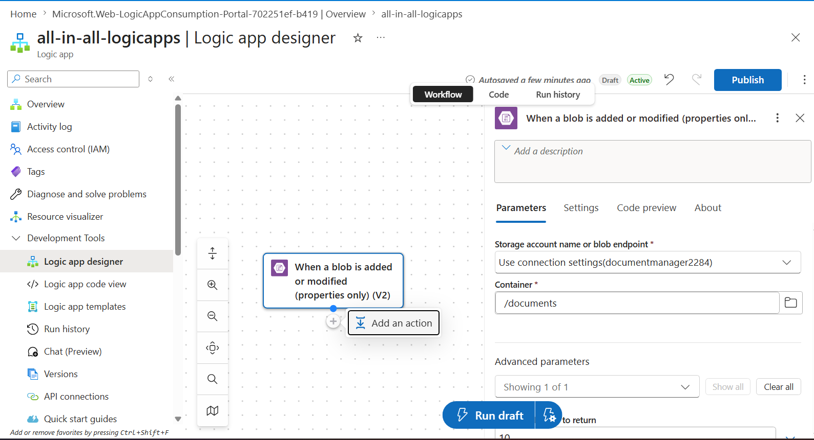
  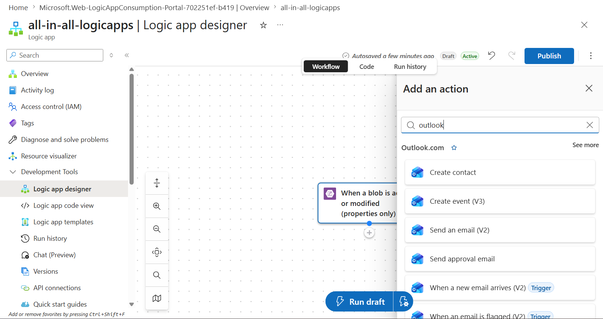
  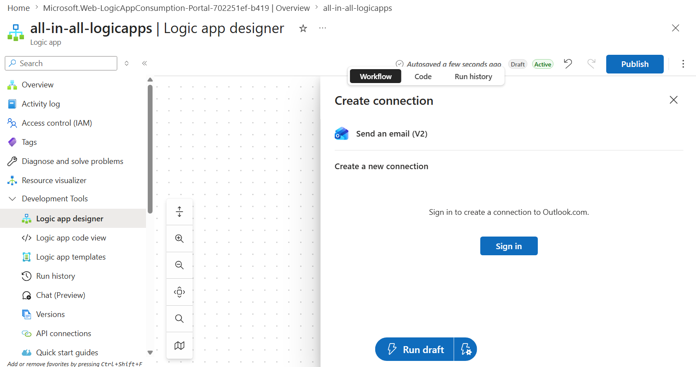
  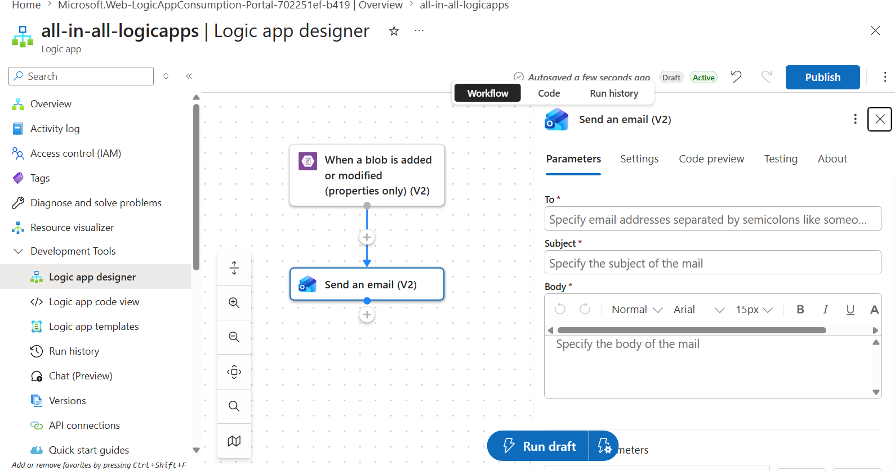
  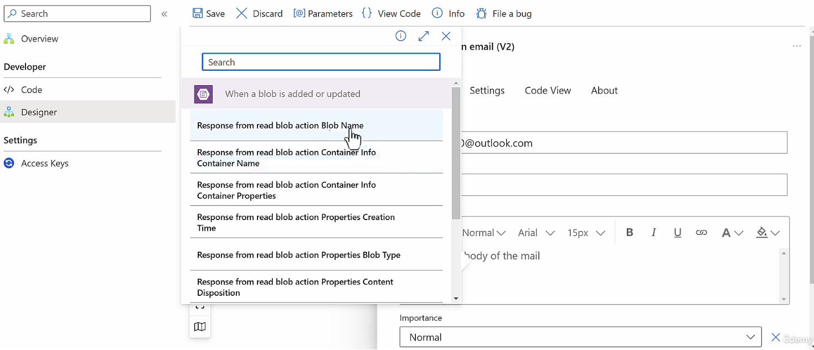
  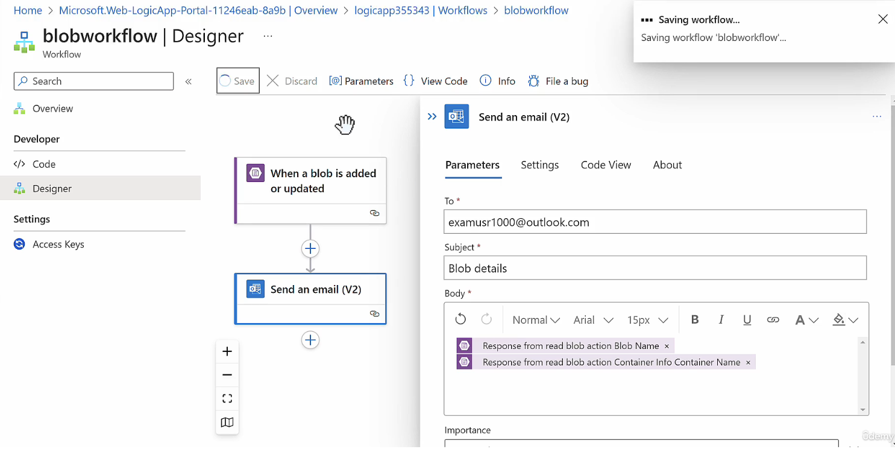
  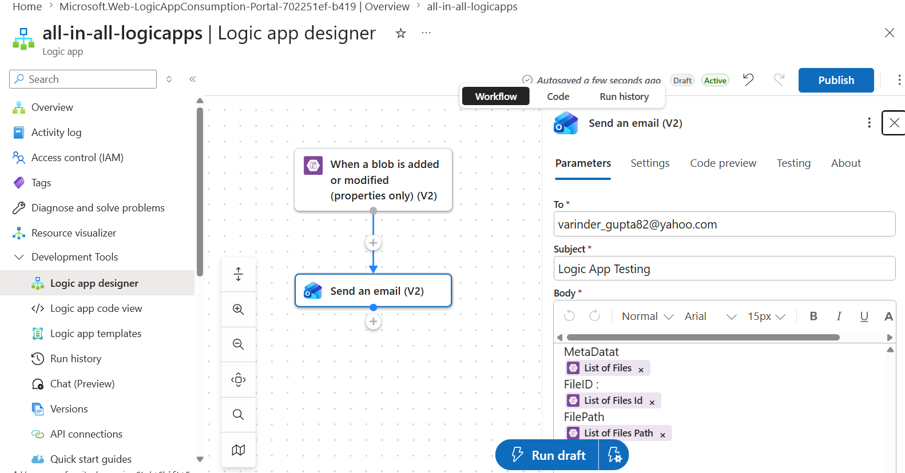
  - Action Types
    - Favourite
    - AI Agent
    - Action in Apps
    - Human in the loop
    - Data Transformation
    - Simple Operation
