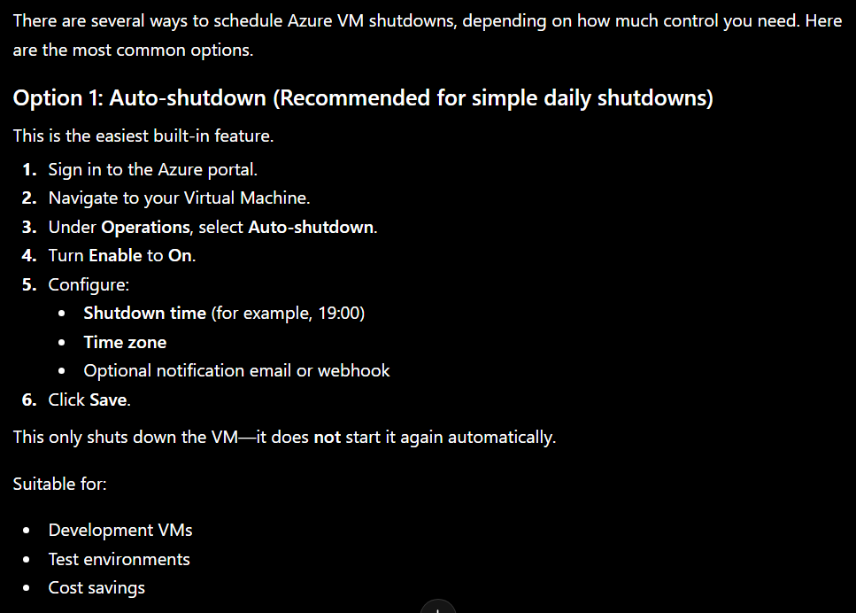

## Scheduled Shutdown



**Option 2 : Azure Logic Apps : For Both Start/Stop Feature**

Schedule trigger
Call Azure Resource Manager
Start/Stop VMs
Send Teams or email notifications
Conditional logic

Good for:

- Approval workflows
- Complex scheduling
- Integration with other Azure services

```
Azure Function
        │
        ▼
Logic Apps (Schedule)
        │
        ▼
Managed Identity
        │
        ▼
Azure Resource Manager
        │
        ▼
Start / Stop Virtual Machines

```
