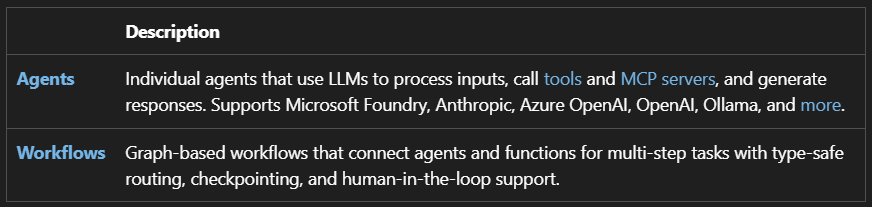
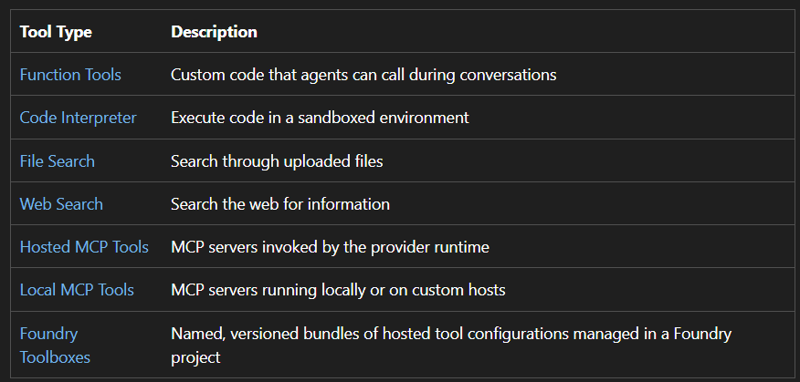
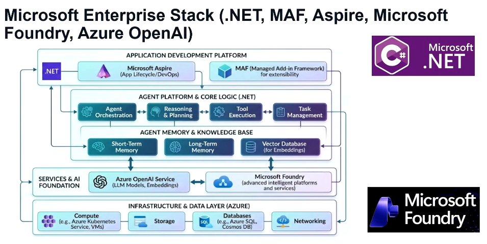

## Overview

MS Agent Framework (MAF) offers two primary categories of capabilities:



The framework also provides foundational building blocks, including

- model clients (chat completions and responses)
- an agent session for state management
- context providers for agent memory
- middleware for intercepting agent actions
- MCP clients for tool integration

Together, these components give you the flexibility and power to build interactive, robust, and safe AI applications.

```
dotnet new console -n AI-Agent-ConsoleApp
```

```
dotnet add package Azure.AI.Projects --prerelease
dotnet add package Azure.Identity
dotnet add package Microsoft.Agents.AI.Foundry --prerelease
```

```
using System;
using Azure.AI.Projects;
using Azure.Identity;
using Microsoft.Agents.AI;

AIAgent agent = new AIProjectClient(
        new Uri("https://foundryallinalldev007.openai.azure.com"),
        new AzureCliCredential())
    .AsAIAgent(
        model: "gpt-5-deployment",
        instructions: "You are a friendly assistant. Keep your answers brief.",
        name: "FriendlyAssistant");

Console.WriteLine(await agent.RunAsync("What is the largest city in France?"));

await foreach (var update in agent.RunStreamingAsync("Tell me a one-sentence 100 wordsfun fact."))
{
    Console.Write(update);
}
```

**DefaultAzureCredential** is convenient for development but requires careful consideration in production. In production, consider using a specific credential (e.g., **ManagedIdentityCredential**)

Benefits:

- Predictable authentication path
- Easier auditing
- Reduced risk of accidental fallback
- Clearer security reviews


## Why MS Agent Framework?

MS Agent Framework combines AutoGen's simple agent abstractions with Semantic Kernel's enterprise features

- Session-based state management
- Type safety
- middleware
- telemetry
- adds graph-based workflows

for explicit multi-agent orchestration

Semantic Kernel and AutoGen pioneered the concepts of AI agents and multi-agent orchestration. The MS Agent Framework is the direct successor , created by the same teams.

## Add Tools

Tools let your agent call custom functions — like fetching weather data, querying a database, or calling an API.

Define a tool as any method with a **[Description]** attribute:

Use **AIFunctionFactory.Create(func)** to instantiate the function

```
using System.ComponentModel;

[Description("Get the weather for a given location.")]
static string GetWeather([Description("The location to get the weather for.")] string location)
    => $"The weather in {location} is cloudy with a high of 15°C.";
```

```
using System;
using Azure.AI.Projects;
using Azure.Identity;
using Microsoft.Agents.AI;
using Microsoft.Extensions.AI;
using System.ComponentModel;


[Description("Get the weather for a given location.")]
static string GetWeather([Description("The location to get the weather for.")] string location)
    => $"The weather in {location} is cloudy with a high of 15°C.";

AIAgent agent = new AIProjectClient(
        new Uri("https://foundryallinalldev007.openai.azure.com"),
        new AzureCliCredential())
    .AsAIAgent(
        model: "gpt-5-deployment",
        instructions: "You are a helpful assistant. Keep your answers brief.",
        name: "FriendlyAssistant",
        tools: [AIFunctionFactory.Create(GetWeather)]);

Console.WriteLine(await agent.RunAsync("What is the weather in Paris, France?"));

```

**Output**

```
The weather in Paris, France is cloudy with a high of 15°C.
```

## Multi-Turn Conversations

Use a session to maintain conversation context so the agent remembers what was said earlier.

Use **AgentSession** to maintain context across multiple calls:

**Without AgentSession**

```
Console.WriteLine(await agent.RunAsync("What is the weather in Paris, France?"));

Console.WriteLine(await agent.RunAsync("Which city I asked the question about?"));
```

**Answer**

```
The weather in Paris, France is cloudy with a high of 15°C.
You didn’t ask about any specific city in this conversation.
```

**With AgentSession**

```
// Create a session to maintain conversation history
AgentSession session = await agent.CreateSessionAsync();

// First Turn
Console.WriteLine(await agent.RunAsync("What is the weather in Paris, France?", session));

// Second Turn
Console.WriteLine(await agent.RunAsync("Which city I asked the question about?", session));
```

**Answer**

```
The weather in Paris, France is cloudy with a high of 15°C.
Paris, France
```

## Memory And Persistance

For long term memory and persistance we use custom ChatHistoryProvider you can pass one to the agent options.

You create one when you want history persisted outside memory, for example:

- Redis
- PostgreSQL
- Cosmos DB
- SQL Server
- Blob Storage

| Component           | Purpose                                                             |
| ------------------- | ------------------------------------------------------------------- |
| AgentSession        | Identifies a conversation and holds session state                   |
| ChatHistoryProvider | Persists and retrieves conversation history                         |
| StateBag            | Stores provider-specific metadata (conversation IDs, DB keys, etc.) |

**A common pattern:**

```
User
  ↓
AgentSession
  ↓
CustomChatHistoryProvider
  ↓
Redis / PostgreSQL / Cosmos DB
```

The session contains:

The provider uses that key to load and save messages.

Use only Session when:

- Chat history can be lost after restart
- Internal tools or demos
- No need to resume conversations later

Use CustomChatHistoryProvider when:

- You need persistent conversations
- Users can resume previous chats
- You want audit/history storage
- Running multiple application instances
- Need Redis/PostgreSQL/Cosmos-backed memory

Lets use CosmosDB for persistence.

```
dotnet add package Microsoft.Agents.AI.CosmosNoSql --prerelease
dotnet add package Microsoft.Azure.Cosmos
```

```
using System;
using System.ComponentModel;
using Azure.AI.OpenAI;
using Azure.Identity;
using Microsoft.Agents.AI;
using Microsoft.Azure.Cosmos;
using Microsoft.Extensions.AI;

[Description("Get the weather for a given location.")]
static string GetWeather(
    [Description("The location to get the weather for.")] string location)
    => $"The weather in {location} is cloudy with a high of 15°C.";

var azureOpenAIEndpoint = "https://foundryallinalldev007.openai.azure.com";
var deploymentName = "gpt-5-deployment";

var cosmosEndpoint = "https://cosmosdb2284.documents.azure.com:443/";
var databaseId = "agentdb";
var containerId = "chatHistory";

// In real app, use stable ID from your app/session.
// Example: $"{userId}:{chatId}"
var conversationId = "user-varinder-chat-001";

var credential = new DefaultAzureCredential();

CosmosClient cosmosClient = new CosmosClient(
    accountEndpoint: cosmosEndpoint,
    tokenCredential: credential,
    new CosmosClientOptions
    {
        AllowBulkExecution = true
    });

Database database = await cosmosClient.CreateDatabaseIfNotExistsAsync(databaseId);

await database.CreateContainerIfNotExistsAsync(
    id: containerId,
    partitionKeyPath: "/conversationId");

// Cosmos-backed history provider.
// Container partition key must be /conversationId.
var historyProvider = new CosmosChatHistoryProvider(
    cosmosClient: cosmosClient,
    databaseId: databaseId,
    containerId: containerId,
    stateInitializer: session =>
        new CosmosChatHistoryProvider.State(
            conversationId: conversationId));

historyProvider.MaxMessagesToRetrieve = 30;
historyProvider.MessageTtlSeconds = -1;

// Azure OpenAI chat client.
// This path does not use Foundry server-side conversation history.
AzureOpenAIClient azureOpenAIClient = new AzureOpenAIClient(
    new Uri(azureOpenAIEndpoint),
    new AzureCliCredential());

IChatClient chatClient = azureOpenAIClient
    .GetChatClient(deploymentName)
    .AsIChatClient();

AIAgent agent = chatClient.AsAIAgent(new ChatClientAgentOptions
{
    Name = "FriendlyAssistant",

    // OK here, because this is framework-managed history.
    ChatHistoryProvider = historyProvider,

    ChatOptions = new ChatOptions
    {
        Instructions = "You are a helpful assistant. Keep your answers brief.",
        Tools = [AIFunctionFactory.Create(GetWeather)]
    }
});

AgentSession session = await agent.CreateSessionAsync();

Console.WriteLine("First turn:");
try
{
    Console.WriteLine(await agent.RunAsync(
        "Who is narendra modi?",
        session));
}
catch (Exception ex)
{
    Console.WriteLine(ex);

    if (ex.InnerException != null)
    {
        Console.WriteLine("INNER:");
        Console.WriteLine(ex.InnerException);
    }

    throw;
}

Console.WriteLine();
Console.WriteLine("Second turn:");
Console.WriteLine(await agent.RunAsync(
    "what are the last 3 questions I asked to you?",
    session));
```

```
  <ItemGroup>
    <PackageReference Include="Azure.AI.OpenAI" Version="2.1.0" />
    <PackageReference Include="Azure.AI.Projects" Version="2.1.0-beta.3" />
    <PackageReference Include="Azure.Identity" Version="1.21.0" />
    <PackageReference Include="Microsoft.Agents.AI.CosmosNoSql" Version="1.10.0-preview.260610.1" />
    <PackageReference Include="Microsoft.Agents.AI.Foundry" Version="1.10.0-preview.260610.1" />
    <PackageReference Include="Microsoft.Azure.Cosmos" Version="3.61.0" />
  </ItemGroup>
```

## Tools

- MS Agent Framework supports many different types of tools that extend agent capabilities.

- Tools allow agents to interact with external systems, execute code, search data, and more.

## Tool Types

#

#

#

#

#



An Enterprise Application with Multi-Agent using

- MS Agent Framework
- MCP
- Dotnet



| Area           | OpenAI Client / Agents SDK                         | Microsoft Agent Framework                             |
| -------------- | -------------------------------------------------- | ----------------------------------------------------- |
| Best for       | Direct OpenAI apps, fast prototypes, custom agents | Enterprise Azure/M365 agent systems                   |
| Ecosystem      | OpenAI API, Responses API, tools, agents           | Azure AI Foundry, Microsoft 365, .NET, Python         |
| Enterprise fit | Good, but you design more governance yourself      | Stronger if company already uses Azure/Microsoft      |
| Orchestration  | Lightweight, developer-controlled                  | More structured workflows, multi-agent, checkpointing |
| Model support  | OpenAI-first                                       | Multi-model / Azure-friendly                          |
| Complexity     | Simpler                                            | Heavier but more enterprise-ready                     |
| Vendor lock-in | OpenAI-centered                                    | Microsoft/Azure-centered                              |

In short: create agents directly in Foundry for simple managed agents; use MFA when enterprise logic and orchestration become complex.

**Example**

For a simple HR FAQ bot:

- Use Azure AI Foundry Create Agent.

For an onboarding process like:

- Read employee data
- Validate documents
- Call HR API
- Ask manager approval
- Create ServiceNow ticket
- Send email
- Track state for days
