## Overview

Helm is a package manager for kubernetes. It uses a package format called charts, which include all the resources needed to run application or a complete cloud-native stack inside kubernetes.

Like

- apt is a package manager for Ubuntu Linux Distribution
- yum is a package manager for Redhat/Centos Linux Distribution
- mvn is a package manager for Maven
- pip is a package manager for Python
- nuget is a package manager for dotnet
- npm is a package manager for javascript

  ```
  apt install package-name
  ```

Similarly we use

```
helm add repo <repo-URL>
helm install <helm-package-name>
```

help-package-name

- grafana
- argocd
- prometheus
- nginx
- custom application helm chart

##

A package manager allow you to

- install
- update
- remove

package

##

I helm you package your application using helm as **Chart**. So any one can install the chart.

## Advantage of using package manager

- package management is easy
- no scripts needed for installation, upgradation, removal for each package for each version and keeping them upto date.
- Automatically install the package and add it into your path
- Automatically take care of package dependencies

## How to install Helm

Check the online documentation

For Debian/Ubuntu Linux Distribution

```
apt-get install helm
```

Install it on the automation machine, nothing on the kubernetes cluster.

From the centralized automation machine, the chart is deployed to different kubernetes cluster dev,test,prod

## How Helm keep track of the context

Like kubectl has kubeconfig file that stores multiple contexts and one of the is current context, helm uses the current context of kubectl.

```
kubectl config list

kubectl config current-context
```

## Helm latest version

```
helm version
```

Helm.V4

## How to install helm-chart/package

It is a 2 step process

1. Add helm repository
2. Install package/chart from that repository

```
helm repo add <local-repo-name> <repo-URL>

helm repo update <local-repo-name>

helm search repo <local-repo-name>

helm search repo <local-repo-name> | grep <chart-name>

helm install <local-chart-name> <package/chart-name>

# List all helm charts

helm list


# To unstall release and delete corresponding Pods
# Release is deployed instance of your chart

helm uninstall <local-chart-name/release>

Note : By default the install command deploys the chart as a pods in the default namespace

helm repo add bitnami https://charts.bitnami.com/bitnami


helm install prometheus bitnami/prometheus

kubectl get pods -w
```

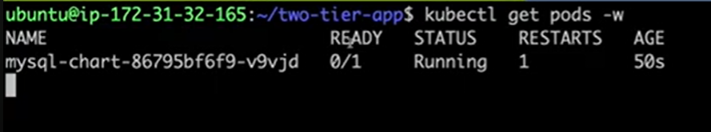

So pod is running but not ready, so it is restarting. Root Causes

- ImagePullIssue
- Liveness and ReadinessProbe endpoint not available

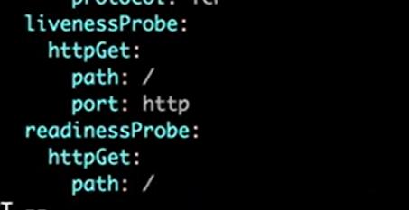

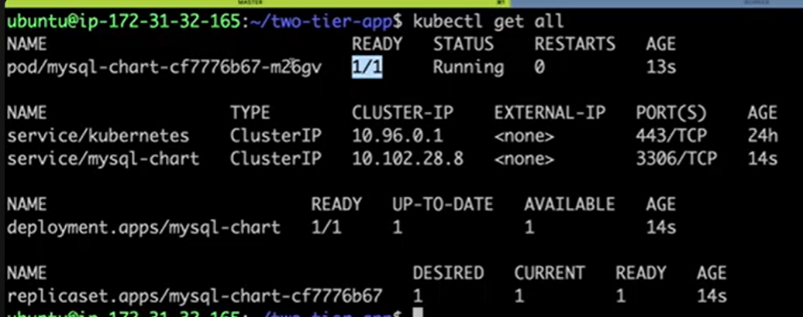

Ubundu - apt use archieve.ubuntu.com repository automatically added so no need to add expicitly

**Chart** : Package of your application, so in helm package is called Chart

So within a repository, we can install those charts stored in that repository.

Most popular helm repository offer multiple charts

```
https://charts.bitnami.com/bitnami
```

Bitnami reposotory does not contain ArgoCD or AWS ingressController Chart

```
helm repo add <local-repo-name> https://aws.github.io/eks/charts

helm repo update <local-repo-name>

helm search repo | grep load

helm install <local-chart-name> eks/aws-load-balancer-controller
-n <namespace>
--set <param-name>=<param-value>
```

## How to package custom application as helm charts

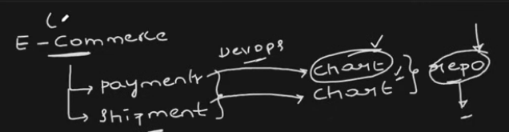

In helm, you deal with docker images and kubernetes pods

```
# Create Basic helm folder structure with base templates

helm create <chart-name>

<chart-name>
|
-- Chart.yaml
|
-- values.yaml
|
-- templates
|
-- charts

- charts : Folder is for dependencies
- Chart.yaml : metadata about the chart
  - owner of chart
  - version of chart
  - version of application
- templates : Contain default yaml files
   - deployments.yaml
   - ingress.yaml
   - hpa.yaml
   - serviceaccount.yaml
   - service.yaml
   - configmap.yaml
   - secretes.yaml
   - Other menifest files
   - Notes.txt
- values.yaml : To make any customization to the environment
   - replica count
   - resource request
   - resource limit
   - environment name dev/test/uat/prod
   - not image version as it is a bad practice


helm package <Folder-name>

This will create a .tgz file (Chart)
```

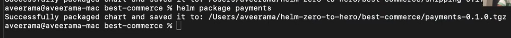

Default deployment.yaml

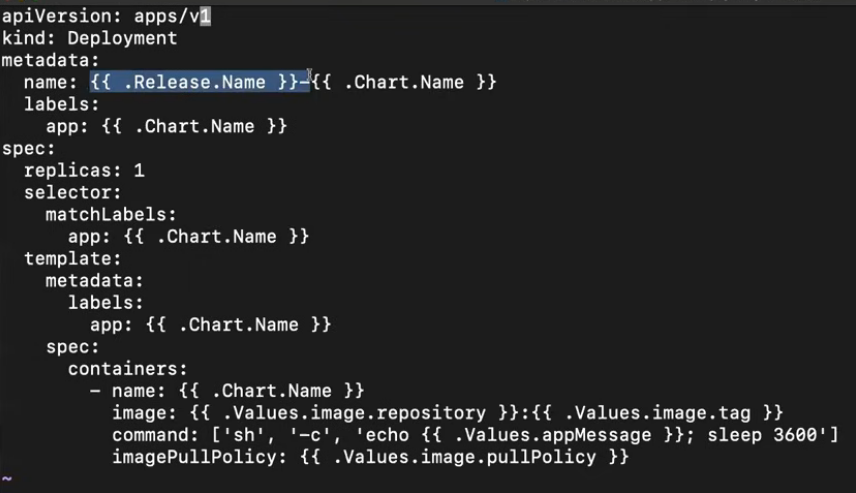

Default values.yaml

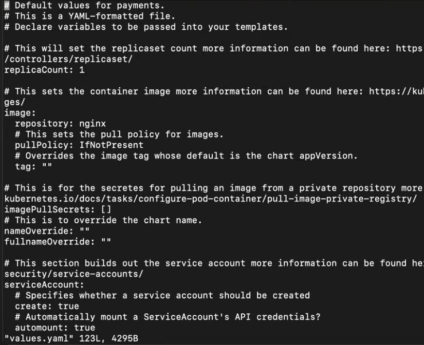
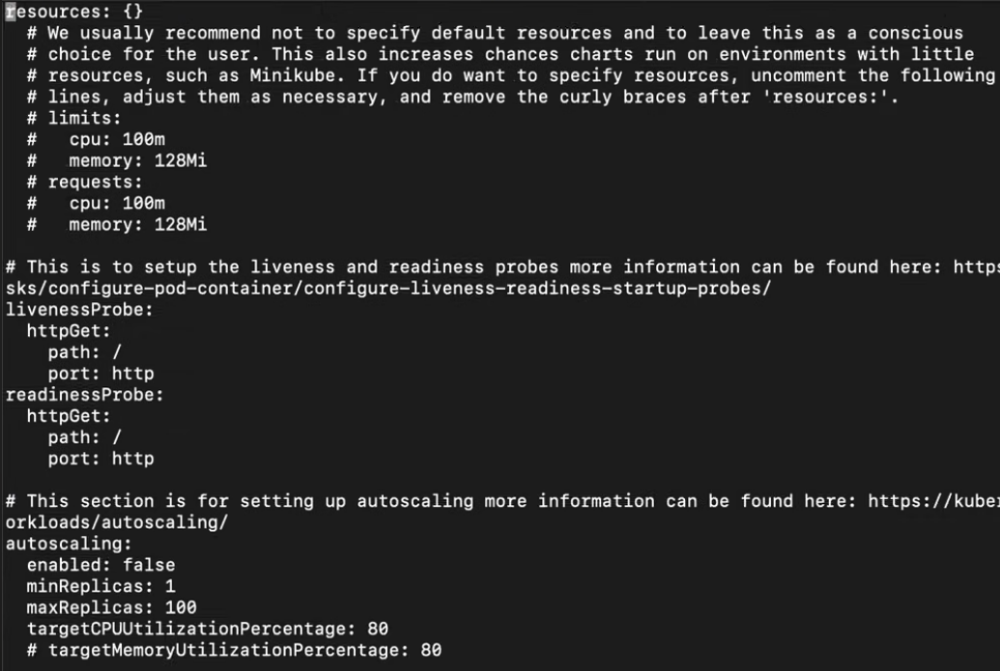
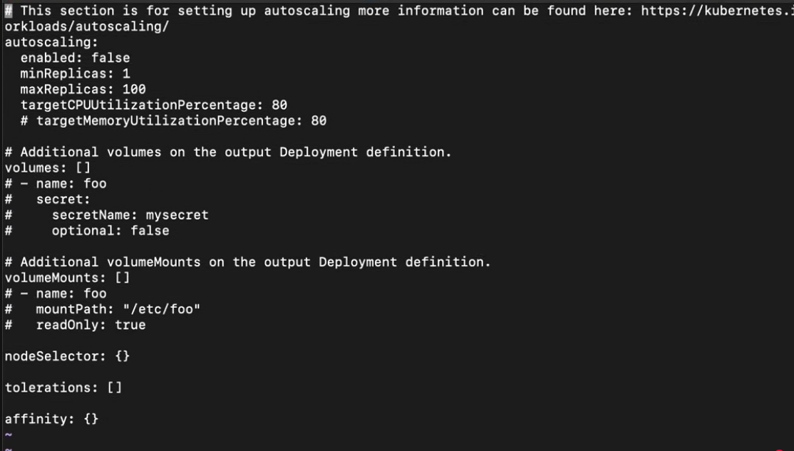

Mini values.yaml

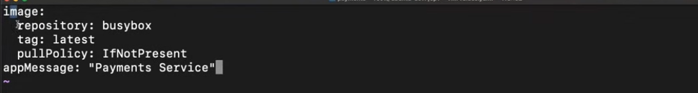

Chart.yaml

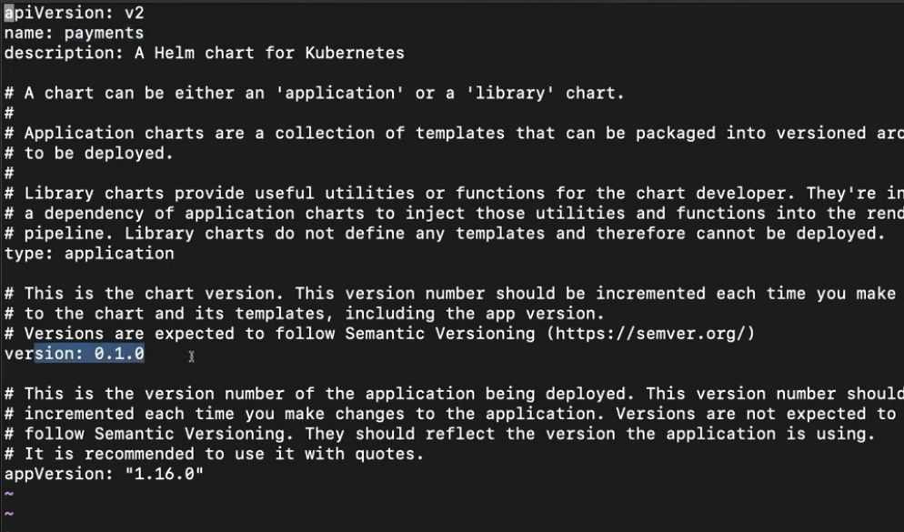

## Helm package for 2 tier application

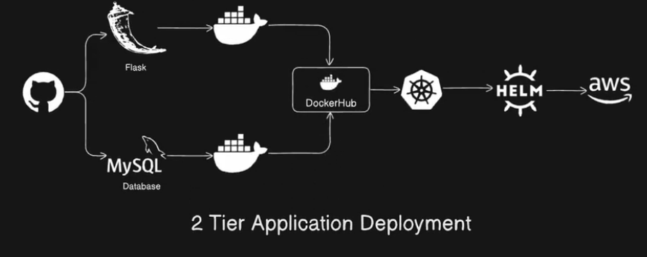

```
helm package <frontend-app>
helm package <backend-app>

```

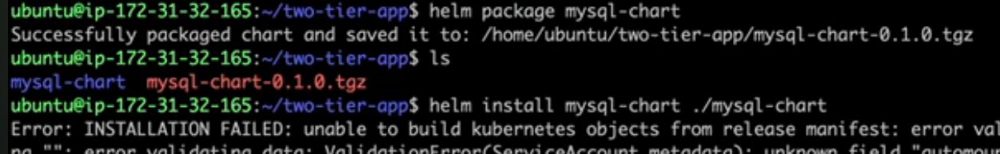

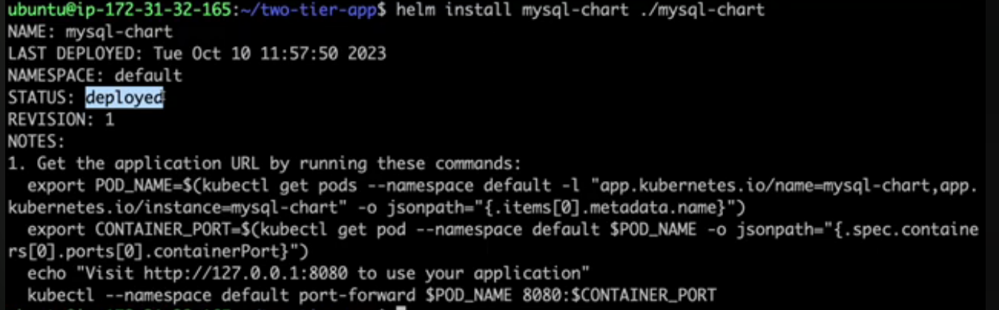

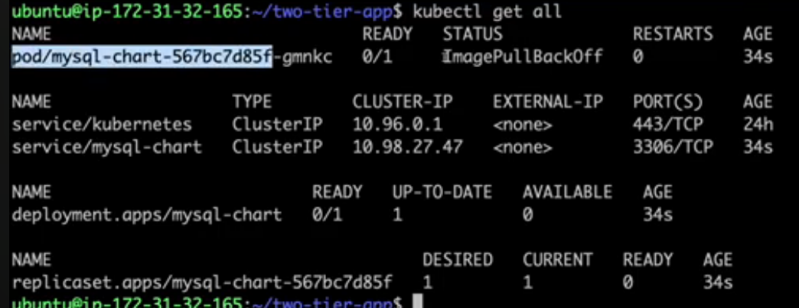

How Front-end application points to the Database service.

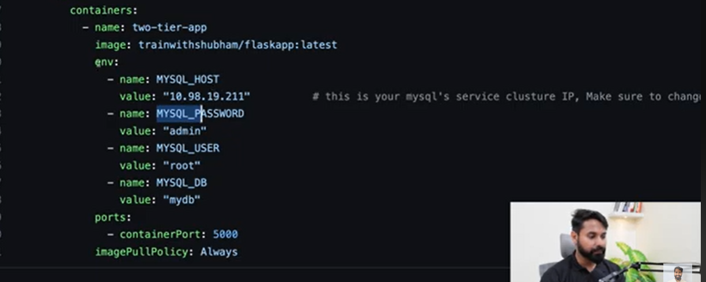

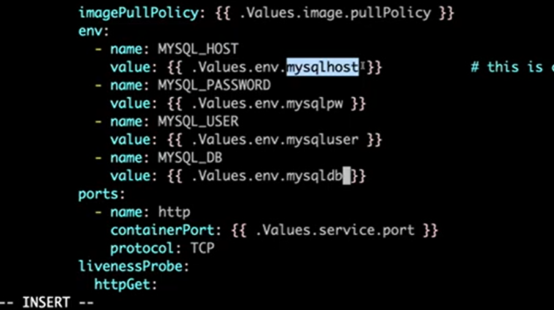

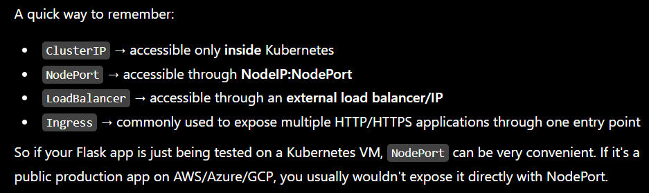

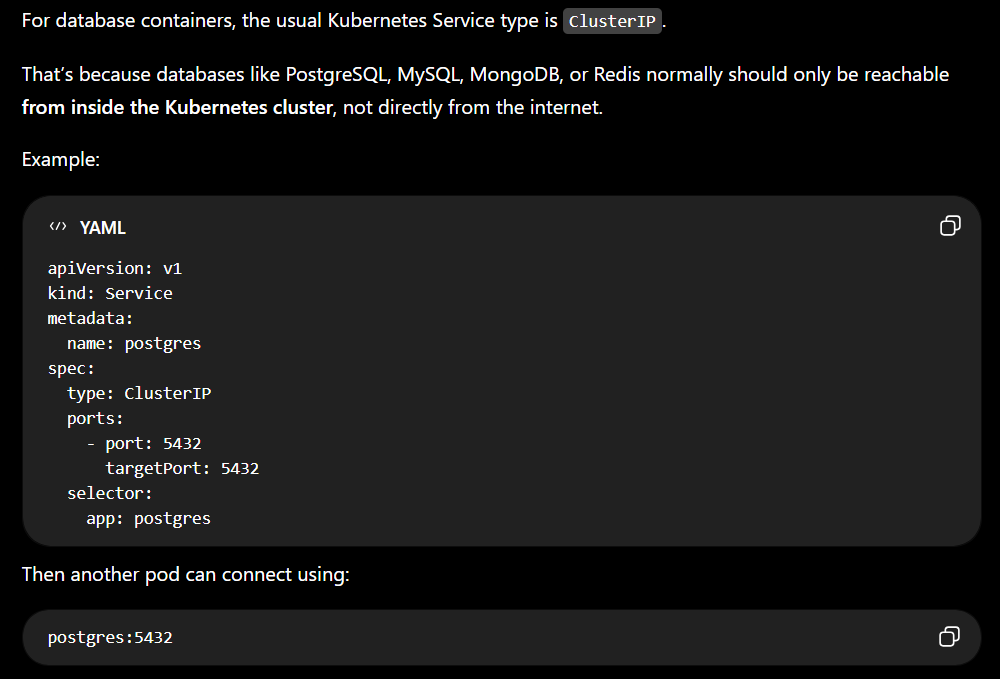

A simple rule of thumb:

- DB container → ClusterIP
- Web app/API → LoadBalancer or Ingress
- Testing/direct node access → NodePort

You generally avoid NodePort or LoadBalancer for a database unless you have a specific reason to expose the DB outside the cluster, because that increases security risk.

## How to check the runtime values of a helm chart

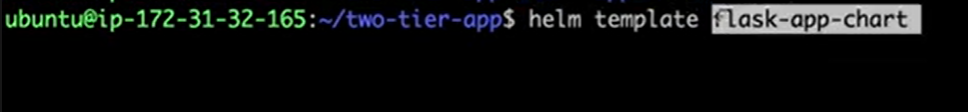

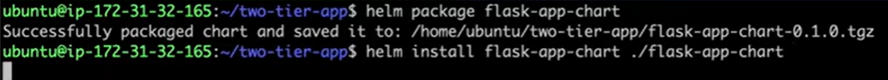

## How to check what all values a chart needed

```
helm show values <chart>
```

## How to use environment variables

**values.yaml**


## How to push helm chart to container registry (Azure ACR, AWS ECR, Docker Hub, GitLab)

Steps

```
Create Helm chart
      ↓
helm package
      ↓
front-end-app-0.1.0.tgz
      ↓
Login to registry (helm registry login myregistry.example.com)
      ↓
helm push (helm push front-end-app-0.1.0.tgz https://myregistry.example.com/helm)
      ↓
Registry stores the Helm chart (https://myregistry.example.com/helm/front-end-app)
      ↓
helm install from registry (helm install frontend \
                            https://myregistry.example.com/helm/front-end-app \
                            --version 0.1.0)

```

```
myregistry.example.com/
├── images/
│   └── front-end-app:1.0
└── helm/
    └── front-end-app:0.1.0
```
