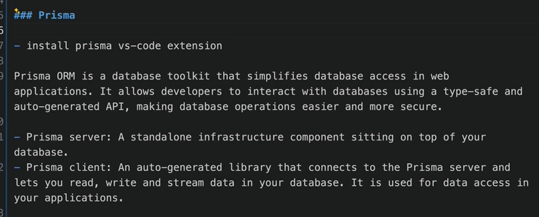
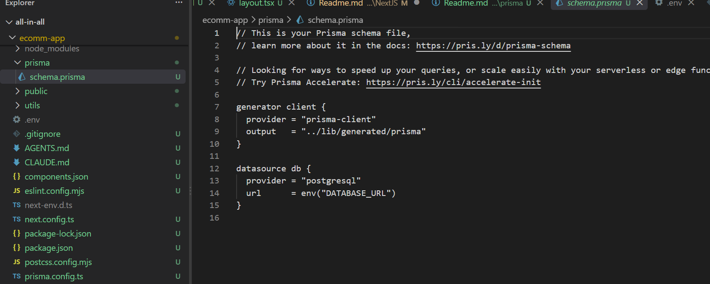
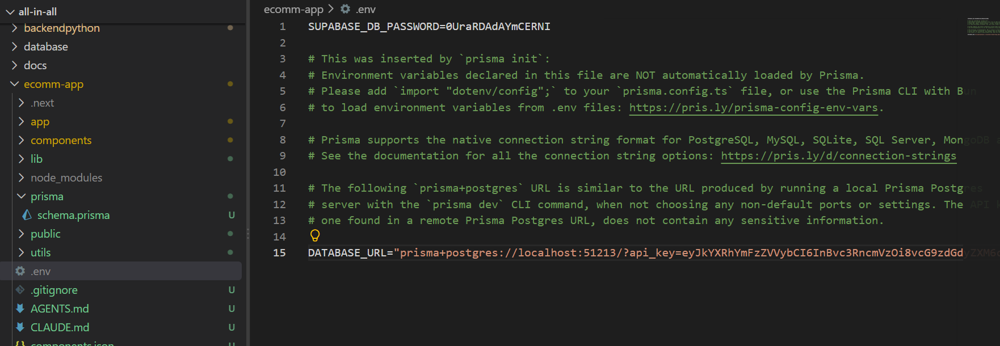
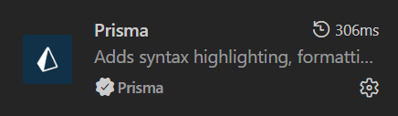
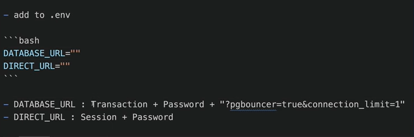
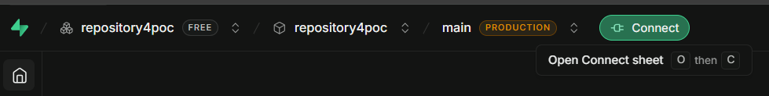

## Supabase and Prisma

- Supabase = PostgreSQL database + backend services
  1. create an organizaiton
  2. create a project within the organization
  3. choose DB Password
- Prisma = ORM that your application uses to talk to that PostgreSQL database.

```
Your app
   │
   ├── Prisma ORM
   │       │
   │       ▼
   │   Supabase PostgreSQL
   │
   └── Supabase Auth / Storage / Realtime
```

```
npm install prisma@6 --save-dev
npm install @prisma/client@6

```



```
npx prisma@6 init
```

This create a `prisma/schema.prisma` file at project root

1. It creates a `prisma/schema.prisma`

   

2. Update the `.env`

   

## Prisma VS Code Extension



## Connect Prisma to Supabase

1. Create `utils/db.tsx`

```
import { PrismaClient } from '@prisma/client';

const prismaClientSingleton = () => {
  return new PrismaClient();
};

type PrismaClientSingleton = ReturnType<typeof prismaClientSingleton>;

const globalForPrisma = globalThis as unknown as {
  prisma: PrismaClientSingleton | undefined;
};

const prisma = globalForPrisma.prisma ?? prismaClientSingleton();

export default prisma;

if (process.env.NODE_ENV !== 'production') globalForPrisma.prisma = prisma;

```

2. Add into `.env`
   - DATABASE_URL=
   - DIRECT_URL=

   

3. Get the Info and update the `.env` file
   - Click Supabase `Connect`
     

4. Update the `prisma/schema.prisma`

   ```
   generator client {
   provider = "prisma-client"
   output   = "../lib/generated/prisma"
   }

   datasource db {
   provider = "postgresql"
   }

   model Product {
   id  String   @id @default(uuid())
   name  String
   company String
   description String
   featured String
   image String
   price Int
   createdAt DateTime @default(now())
   updatedAt DateTime @updatedAt
   clerkId String
   }

   ```

5. Update the `prisma.config.ts`

   ```
   import 'dotenv/config';
   import { defineConfig, env } from 'prisma/config';

   export default defineConfig({
   schema: 'prisma/schema.prisma',

   datasource: {
      url: env('DIRECT_URL'),
   },
   });

   ```

6. Push `prisma/schema.prisma` changes into the `Supabase` Database

   ```
   npx prisma db push
   ```

7. How to access Supabase database using Prisma

   ```
   $ npx prisma studio

   ```

8. Seed Data

   ```
   $ npx tsx prisma/seed.ts
   ```
