## Metrix

- It is one of the piller in Observability along with Logging
- Metrics are based on numeric information
- that measurements based on data points what is happening about a specific aspect
  - Aspects like
    - Node CPU
    - Node Heart Beat
    - Node Memory
    - Node Disc Utalization
    - Request Processing time
    - Request Count

## Monitoring

- It is the process of keeping an eye on these metrics over time to understand is everything normal or there is any change happened.
- It helps identifying abnormality and problems.

**Conceptually**

Monitoring = Metrics + Dashboards + Alerts

## Prometheus

- An opensource tool/solution for monitoring
- Offer features like
  - Metrices
    - Node CPU
    - Pod Status
      - How many time a pod went into Crashloopbackoff throughout a day.
      - At what time Pod went through Crashlookbackoff state
    - Deployent status
      - Replica status throuhout the day.
    - Application specific metrics
      - No. of http request received in last 5 min.
      - Total number of req. received in a day
      - Users signed up count
  - Dashboard
  - Alerts

All the metrics you want to collect depends on the company and project, you can collect 100s of matrics

The main purpose is to monitor the health of your application and system.

These metrics are either

- Fed to the monitoring system (Push Mechanism) or
- monitoring system automatically pull these metrics (Pull/Scraping mechanism).

The monitoring solution provide use the capability to fire an alert on a specific threshold breach for a specfic metrics called **Alert rules**.

**Alert rule specify**

- when to fire the alert
- where to fire the alert

```
Metrics Source
|
V
Prometheus
|
V
Alert Manager
|
V
Alert
```

## Prometheus Architecture

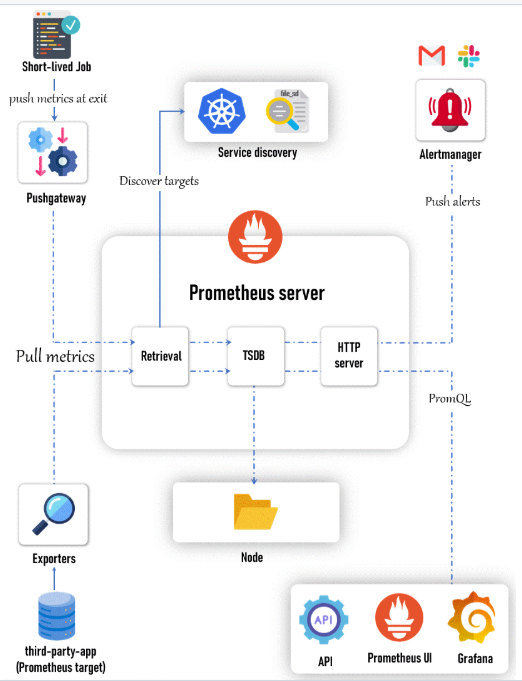

Key Components

- Prometheus Server
  - Retrival : Pull the info from exporters. so all the metrics data collected is stored in the TSDB
  - TSDB : Store the metrics information into a Time Serier Database
    - Timestamp -> Key / Value
  - HTTP Server : To get the information from Prometheus using PromQL
- Service Discovery : help specifying targs to fetch metrics from custom applications deployed onto kubernetes
- Alertmanager :
  - responsible for managing alerts
  - It takes care of deduplicating, grouping, and routing alerts to the appropriate notification channels such as PagerDuty, email, or Slack.
- Exporters :
  - Exporters are small applications/add-ons/plugins that collect metrics from various third-party systems and expose them in a format Prometheus can scrape.
  - They are essential for monitoring systems that do not natively support Prometheus.
  - Types of Exporters:
    - Node Exporter
      - For Infrastrcture Monitoring
      - Runs on your kubernetes cluser as a pod and collect information from all your kubernetes nodes. Information like
        - CPU Utalization
        - Memory Utalization
        - Disk Utalization
    - Kube-state-metrics Exporter
      - For Kubernetes Objects Monitoring
      - Runs on your kubernetes cluser as a pod and collect information regarding kubernetes objects like Pod events, Config Maps, Secrets via API Server
    - Custom metrics
      - For Application Monitoring
      - Developed by the developer as /metrics endpoint collecting and returning information like
        - Number of HTTP requests in last 5 minutes
        - Average Request processing time
        -
      - For application level metrics
    - MySQL Exporter (for MySQL database metrics)
    - various other application-specific exporters.

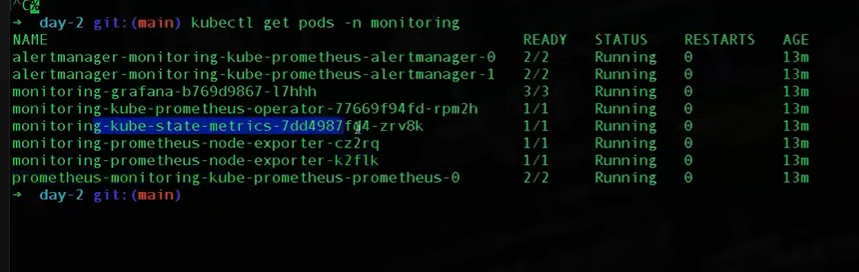

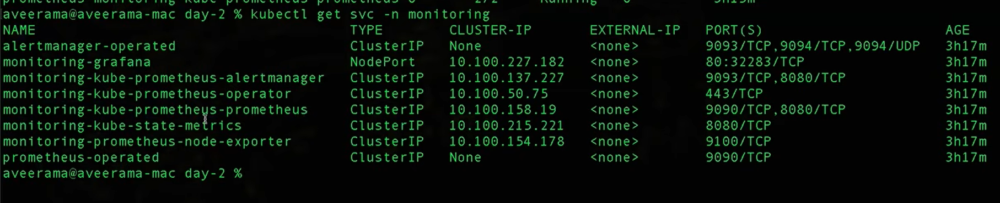

As clusterIP services can only be accessible from inside the Kubernetes, not from outside like your local browser, so you can login to the kubernetes cluster node and then access it from there.

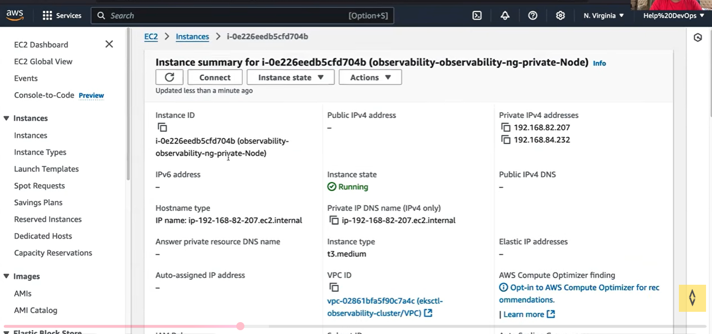

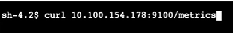

Below is the list of information your node exporter collecting periodically.

The information is in the format, prometheus understand. Thats the purpose of an exporter.

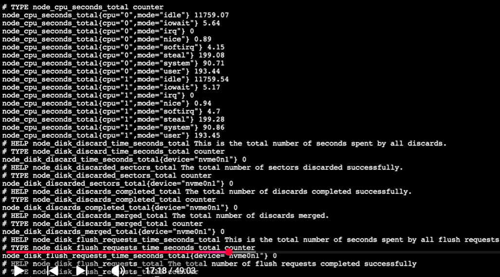

**For kube-state-exporter**

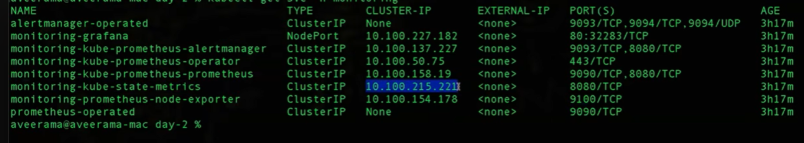

From within the kubernetes node.
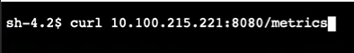

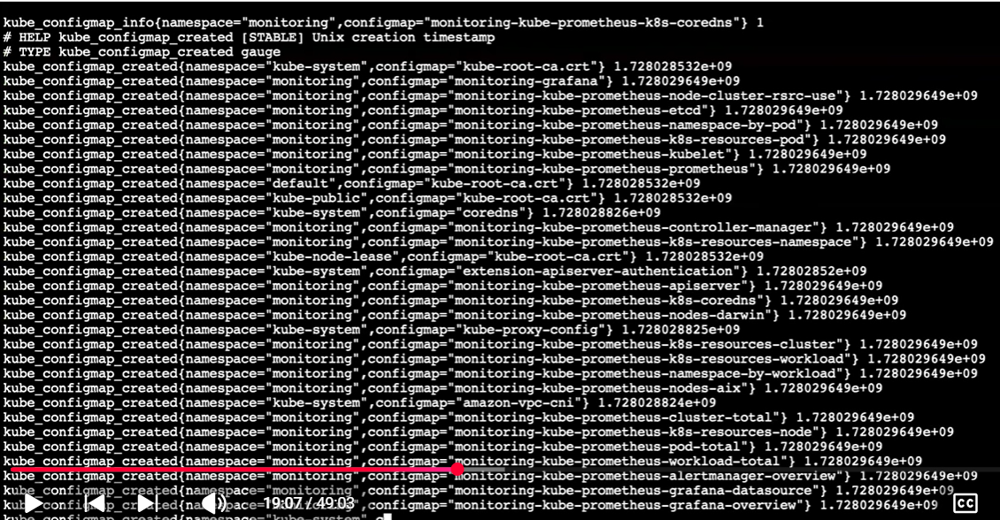

## How to create a pod the crash for testing pod crash scenarios

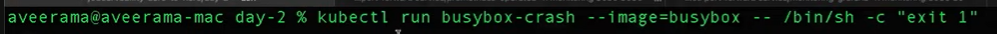

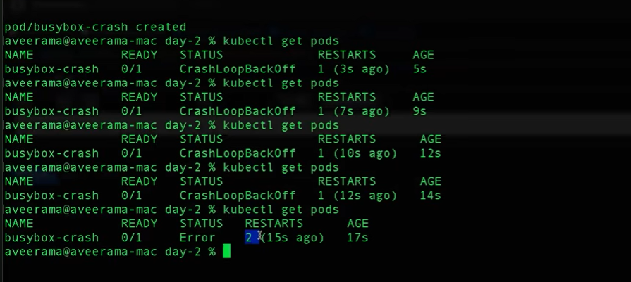

**PromQL Example**

[For specific namespace]
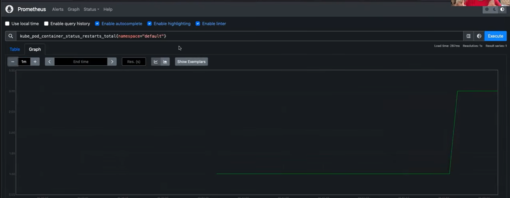

[For all namespaces]
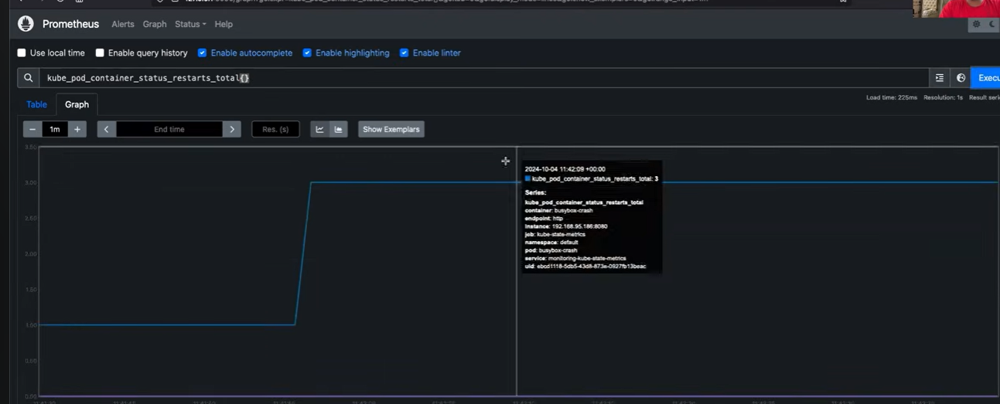

[For PromQL : refer the /metrics]
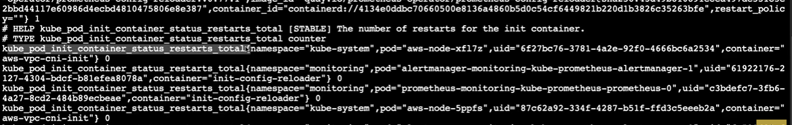

As if you see the prometheus visualization is not that good, so we prefer to go with Grafana for visualization

**Prometheus Autocomplete Feature**

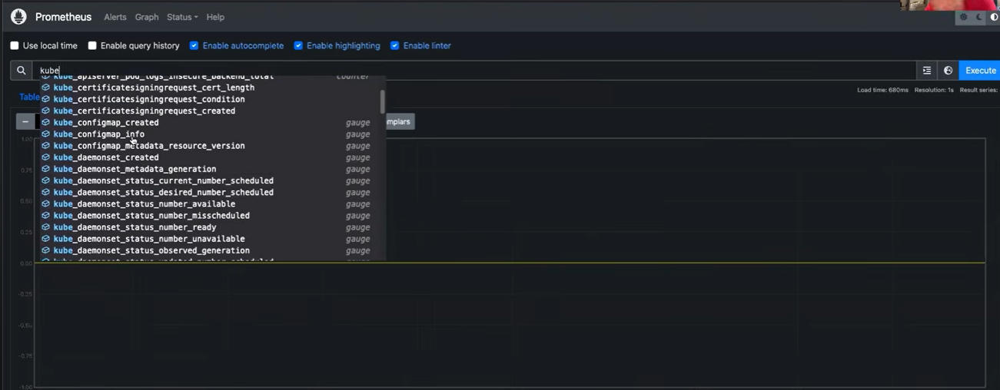

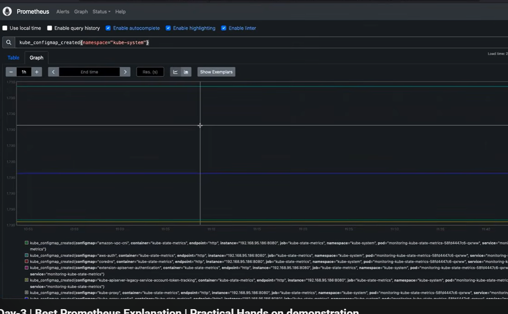

## Common Matrics

- How many times the pod has crashed over 5 min
- How many times config maps are created over a period of time
- How many secrets are there in your kubernets cluster
- CPU / Memory / Disk utalization
- HTTP request, Users Created ,

## Grafana

- Grafana is a powerful dashboard and visualization tool that integrates with Prometheus to provide rich, customizable visualizations of the metrics data.
- Both Prometheus and Grafana used together as a monitoring stack.
- Grafana supports data sources like
  - prometheus
  - graphite
  - nagios
  - influxDB

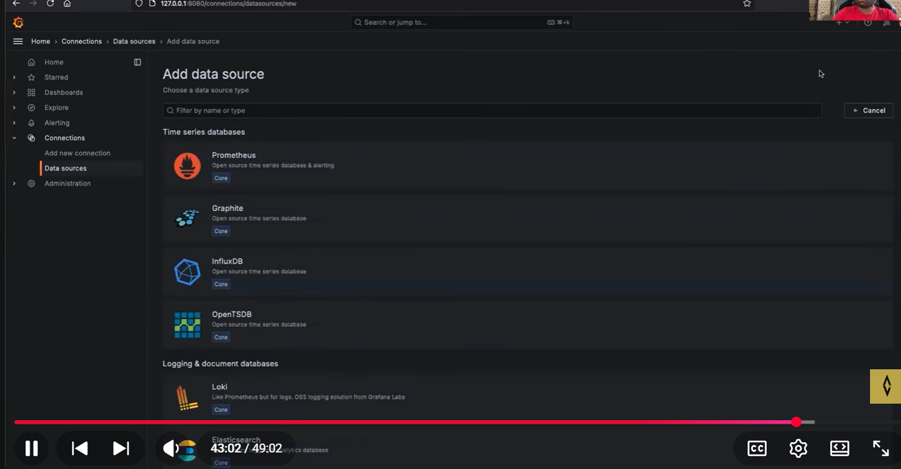

So you can chenage the data source keepting the visualiation intact

- Grafana is a not a monitoring tool, it is a visualization tool.

- Grafana also support authentication and authorization. where prometheus does not has any authentication and authorization. You can integrate it with IAM, EntraID or SSO

- So you can have different dashboard for
  - Developers
  - QA
  - Managers
  - DevOps

- Grafana provide pre-defined graphs, which is not in the case of prometheus, you have to write PromSQL for the graph.

  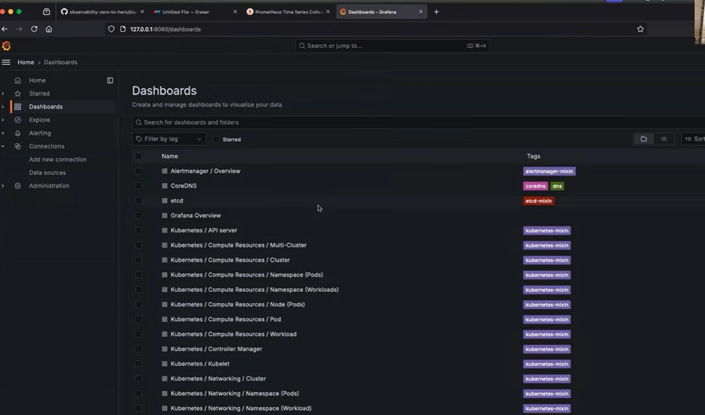

- Grafana uses the same PromQL for custom graphs
  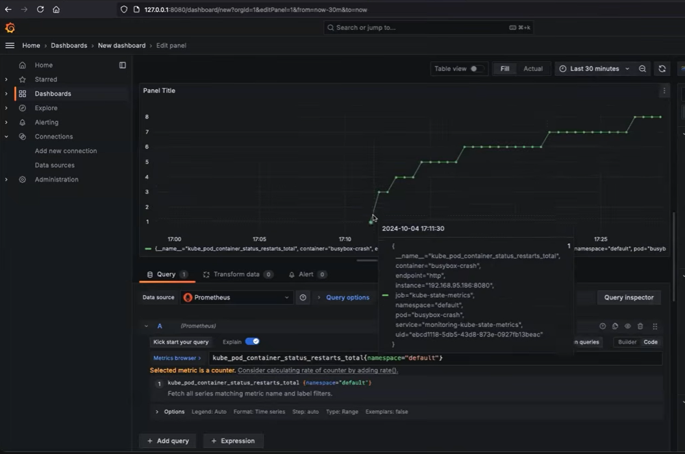

## Install kube-prometheus-stack

```
helm repo add prometheus-community https://prometheus-community.github.io/helm-charts

helm repo update

[Deploy the chart into new namespace]
kubectl create ns monitoring

helm install monitoring prometheus-community/kube-prometheus-stack \
-n monitoring \
-f ./values.yml

kubectl get all -n monitoring

[Prometheus UI]
kubectl port-forward service/prometheus-operated -n monitoring 9090:9090


[Grafana UI]
kubectl port-forward service/monitoring-grafana -n monitoring 8080:80

[Grafana Username]
kubectl get secret --namespace monitoring monitoring-grafana -o jsonpath='{.data.admin-user}' | base64 -d

[Grafana Password]
kubectl get secret --namespace monitoring monitoring-grafana -o jsonpath='{.data.admin-password}' | base64 -d

[Alertmanager UI]
kubectl port-forward service/alertmanager-operated -n monitoring 9093:9093
```

**values.yml**

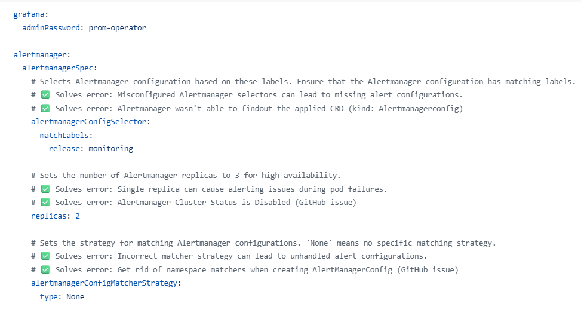

## Uninstall helm chart

```
helm uninstall monitoring --namespace monitoring

kubectl delete ns monitoring
```

Note: Instead of port-forwarding, use ingress controller as best practice

## How to connect grafana to prometheus

1. Add Prometheus Connection
   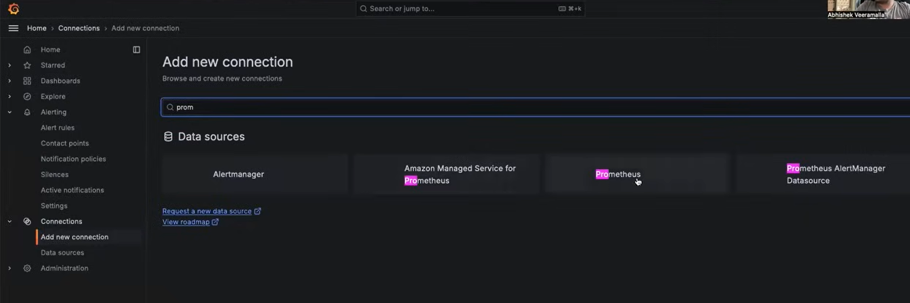

## Competetors to Prometheus

- Graphite
- InfluxDB
- Nagios

## Basic Examples of PromQL

1. Return all time series with the metric container_cpu_usage_seconds_total

   ```
   container_cpu_usage_seconds_total
   ```

2. Return all time series with the metric container_cpu_usage_seconds_total and the given namespace and pod labels.

   ```
   container_cpu_usage_seconds_total{namespace="kube-system",pod=~"kube-proxy.*"}
   ```

3. Return a whole range of time (in this case 5 minutes up to the query time) for the same vector, making it a range vector.

   ```
   container_cpu_usage_seconds_total{namespace="kube-system",pod=~"kube-proxy.*"}[5m]
   ```

## Aggregation & Functions in PromQL

1. Total increase in container restarts over the last hour.

   ```
   increase(kube_pod_container_status_restarts_total[1h])
   ```

2. Calculates the rate of CPU usage over 5 minutes

   ```
   rate(container_cpu_usage_seconds_total[5m])
   ```

3. aggregates the CPU usage across all nodes

   ```
   sum(rate(node_cpu_seconds_total[5m]))
   ```

4. Average memory usage grouped by namespace.

   ```
   avg(container_memory_usage_bytes) by (namespace)
   ```

## Observability Stack

Observability Stack

- Prometheus : For Monitoring
- Grafana : For advance dashboards
- EFK : For log aggregation
- Jaeger : For dynamic tracing

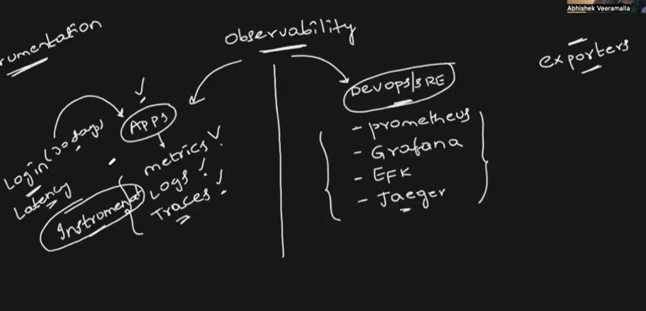

## Prometheus Metrics Types

- **Counter Metrics** : If the nature of metrics is always incrementing
  - Total HTTP requests over last 10 days
  - Total Account Created over last 10 days
- **Gauge Metrics** : If the nature of metrics is incrementing as well as decrementing
  - No. of Config Maps
  - CPU/Memory Utalization
- **Histogram** : If you need some bucket of information, rather than incrementing or decrementing.
  - How many times CPU utalization go below 50%
  - How many times HTTP request duration < 10 ms
  - How many times HTTP request duration > 10 and < 100 ms
  - How many times HTTP request duration > 100 ms

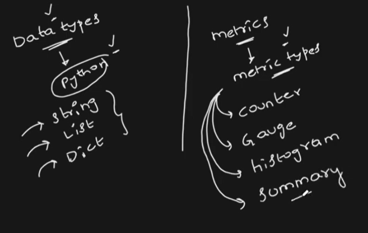

## Instrumenting custom metrics

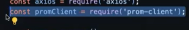

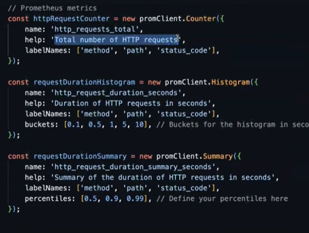

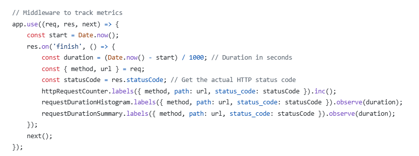

On deployment of your application you application must be ommitting matrics at the /metrics endpoint

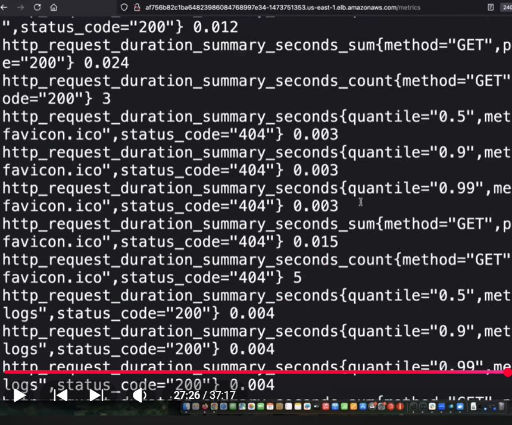

## Service Discovery

For custom metrics, to be queried from prometheus, you need to tell kubernetes what all custom metrics to fetch.

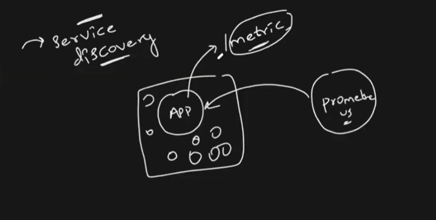

[Service Monitor]

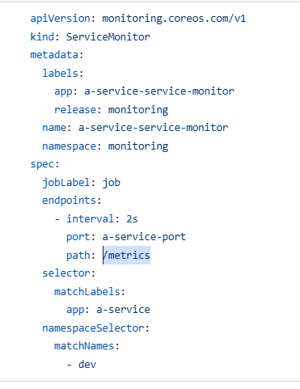

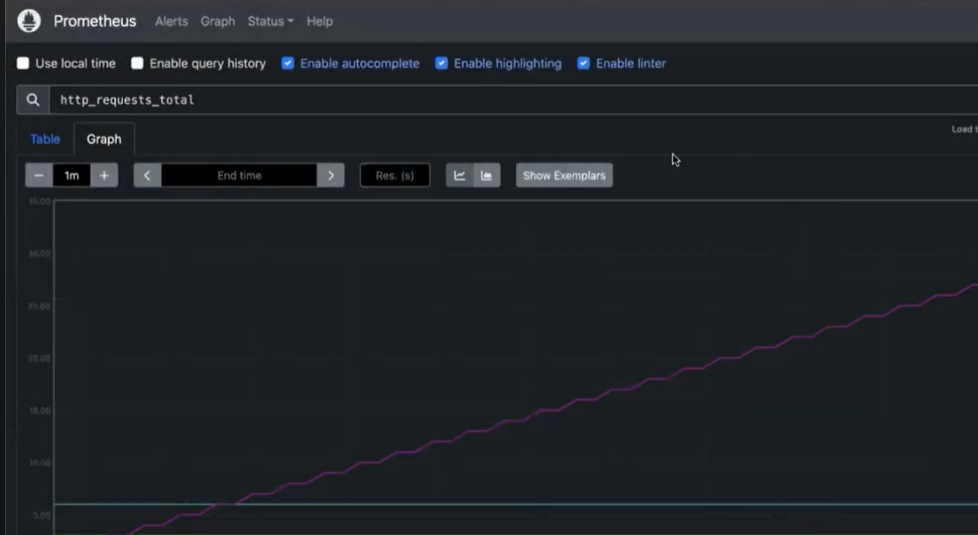

**Steps**

1. Instrument the metrics
2. Setup of Prometheus
3. Service Discover (ServiceMonitor)

## Alert Manager

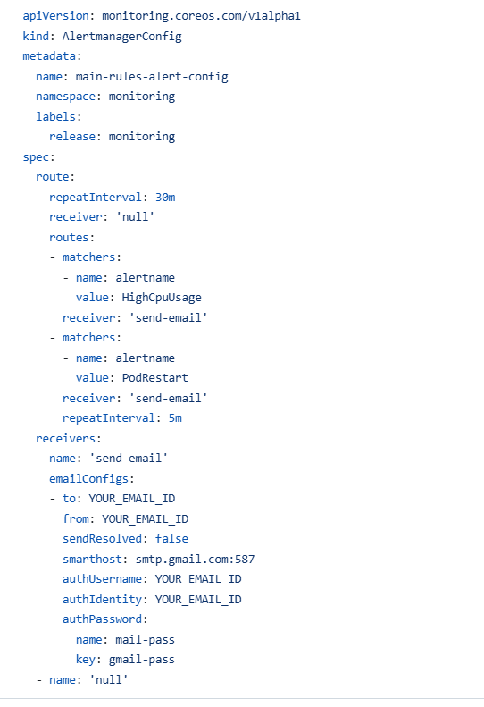

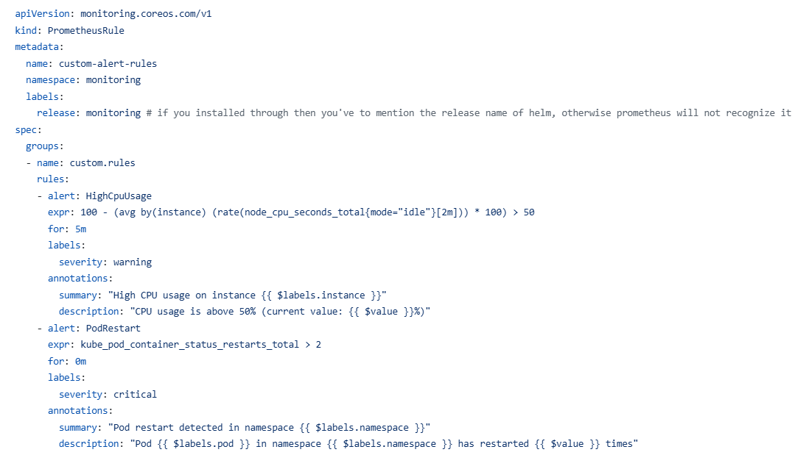

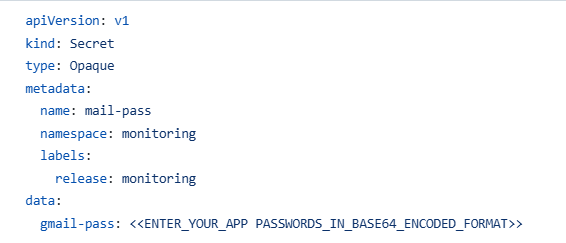

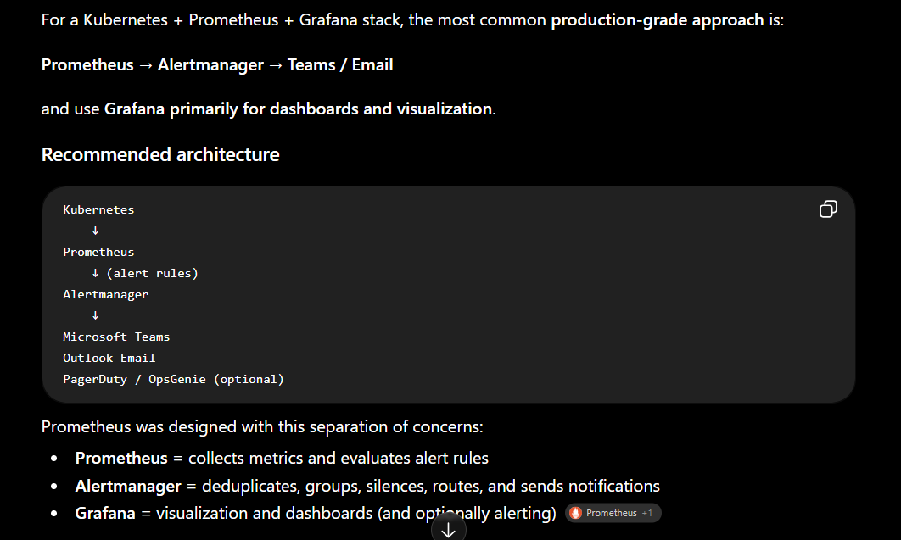

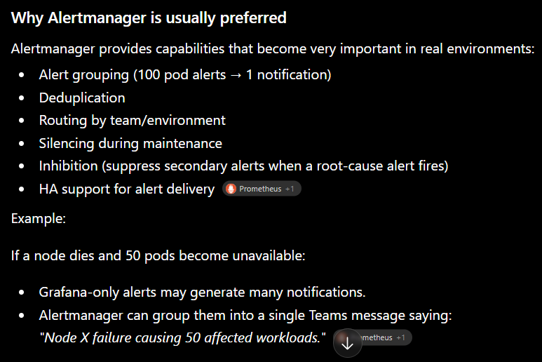

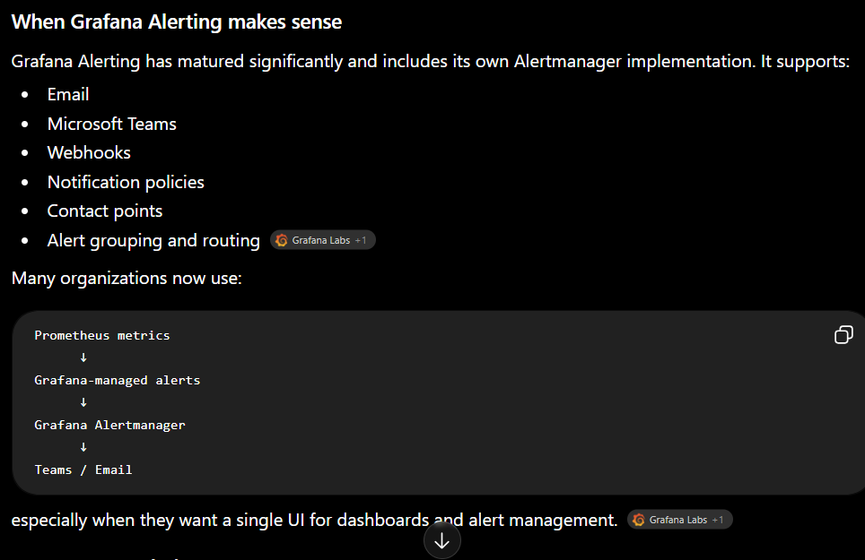

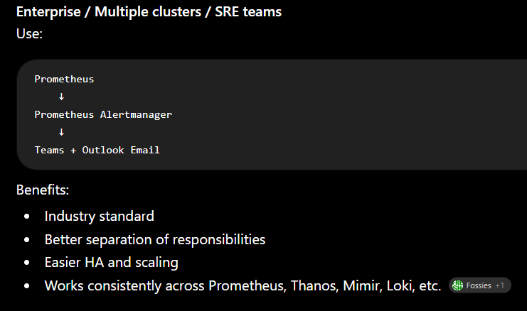

## What is Prometheus

Prometheus is an open-source monitoring and alerting system designed for collecting, storing, and querying time-series metrics. It is widely used for cloud-native applications and Kubernetes environments.

## What are the main components of Prometheus?

- Prometheus Server – Collects and stores metrics.
- Exporters – Expose metrics from systems/applications.
- Alertmanager – Handles alerts and notifications.
- Pushgateway – Accepts metrics from short-lived jobs.
- PromQL – Query language for metrics.
- Service Discovery – Dynamically finds targets.

## How does Prometheus collect metrics

Prometheus uses a pull model, where it periodically scrapes metrics from configured targets over HTTP.

```
scrape_configs:
  - job_name: 'node'
    static_configs:
      - targets: ['localhost:9100']
```

## What are the four metric types in Prometheus?

| Type      | Description                                                      |
| --------- | ---------------------------------------------------------------- |
| Counter   | Only increases (e.g., requests_total)                            |
| Gauge     | Can increase or decrease (e.g., memory usage)                    |
| Histogram | Measures distributions and latency                               |
| Summary   | Similar to histogram but calculates quantiles on the client side |

## What is the difference between Histogram and Summary?

| Histogram                        | Summary                        |
| -------------------------------- | ------------------------------ |
| Quantiles calculated on server   | Quantiles calculated on client |
| Aggregatable across instances    | Not aggregatable               |
| Preferred in distributed systems | Less flexible                  |

For Kubernetes and microservices, Histogram is generally preferred.

## What are Labels?

Labels are key-value pairs attached to metrics.

```
http_requests_total{method="GET",status="200"}
```

Benefits:

- Filtering
- Aggregation
- Grouping

## How do you calculate Requests Per Second?

```
rate(http_requests_total[1m])
```

For all instances

```
sum(rate(http_requests_total[1m]))
```

## How do you calculate Error Percentage?

```
(
 sum(rate(http_requests_total{status=~"5.."}[5m]))
 /
 sum(rate(http_requests_total[5m]))
) * 100
```

## What is Alertmanager?

Alertmanager manages alerts generated by Prometheus.

Functions:

- Deduplication
- Grouping
- Routing
- Silencing

Notification channels:

- Email
- Slack
- PagerDuty
- Microsoft Teams

## What is the purpose of the for clause in alerts

The alert fires only if the condition remains true for 5 minutes.

Prevents false alarms.

```
- alert: HighCPU
  expr: cpu_usage > 80
  for: 5m
```

## What is Service Discovery?

rometheus automatically discovers targets.

Supported:

- Kubernetes
- Consul
- EC2
- Azure
- GCP

## How do you find the top 5 CPU-consuming instances

```
topk(5,
rate(process_cpu_seconds_total[5m])
)
```

## Why is Prometheus considered pull-based

Prometheus initiates metric collection.

Advantages:

- Simpler architecture
- Easier health checking
- Automatic target validation

## Prometheus memory usage suddenly increased from 4GB to 20GB after a deployment. What would you check?

- Check newly added labels.
- Review new exporters.
- prometheus_tsdb_head_series
- Remove unnecessary labels and restart scraping.
