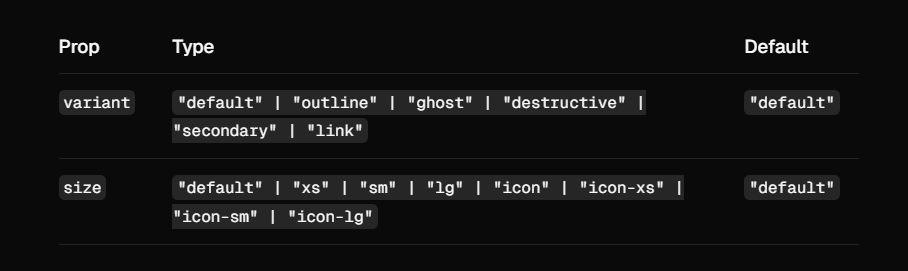
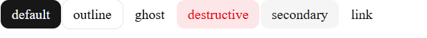
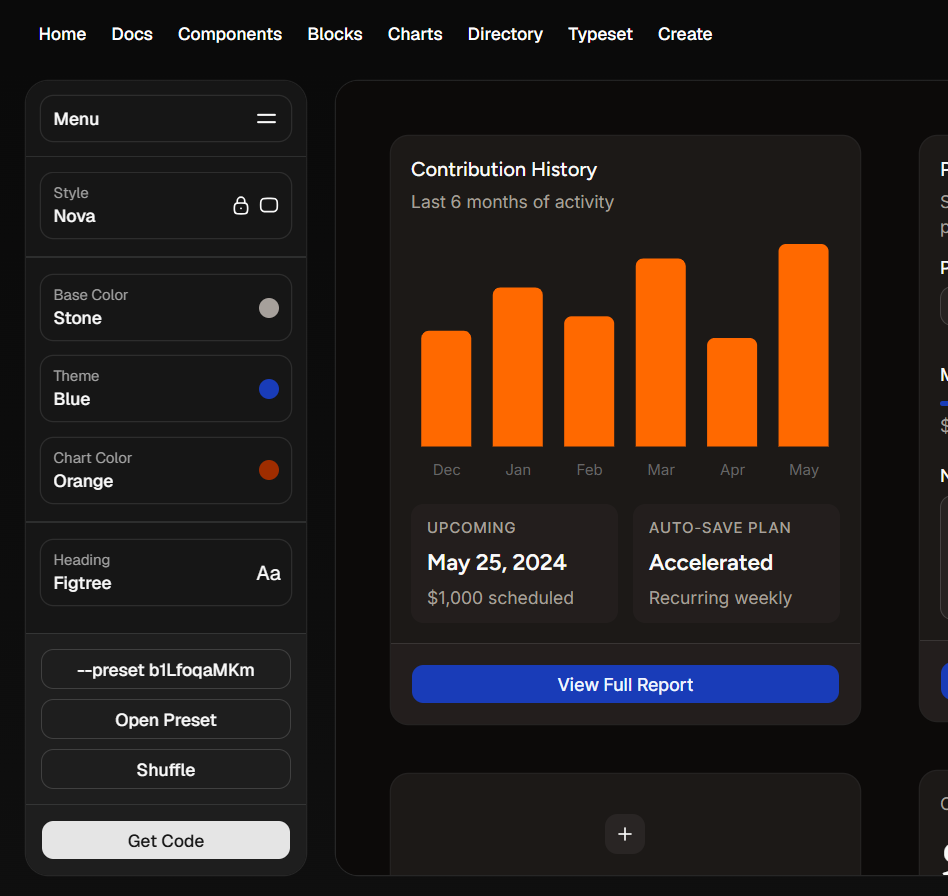
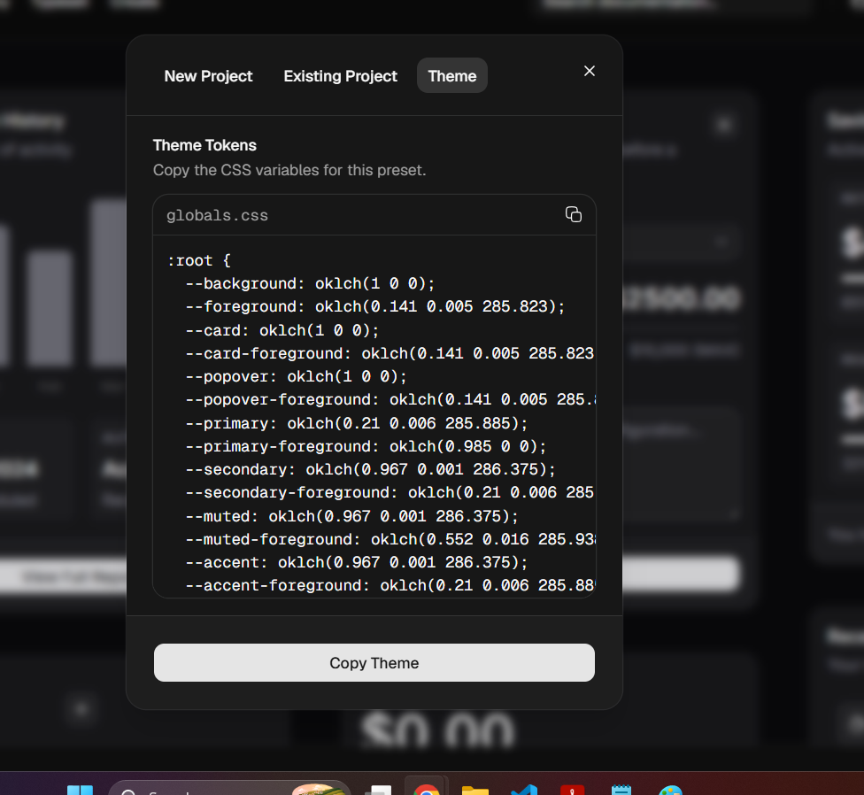
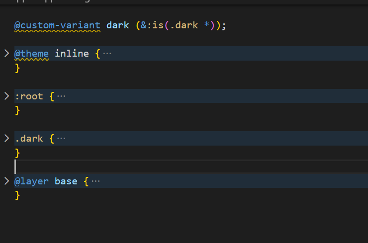

## Shadcn/UI

- A set of pre-designed components and a code distribution platform
- Works with your favorite frameworks and AI models.
- Open Source
- Open Code.

|                        | **shadcn/ui**                     | **Bootstrap**           |
| ---------------------- | --------------------------------- | ----------------------- |
| Approach               | Copy components into your project | Install a UI framework  |
| Styling                | Tailwind CSS                      | Bootstrap CSS           |
| Customization          | ⭐⭐⭐⭐⭐                        | ⭐⭐⭐                  |
| Modern UI              | ⭐⭐⭐⭐⭐                        | ⭐⭐⭐                  |
| Speed to build         | ⭐⭐⭐⭐                          | ⭐⭐⭐⭐⭐              |
| React/Next.js          | **Excellent**                     | Good                    |
| Accessibility          | Very good                         | Good                    |
| Components             | Good, composable                  | **Huge library**        |
| Design freedom         | **Very high**                     | Moderate                |
| Bundle/control         | **Excellent**                     | More framework overhead |
| Learning curve         | Moderate                          | **Easy**                |
| Admin dashboards       | Excellent                         | **Excellent**           |
| Highly branded product | **Winner**                        | Can feel generic        |
| Legacy projects        | —                                 | **Winner**              |

## Installation

`For Exiting NextJS Project`

```
npx shadcn@latest init

```

https://ui.shadcn.com/docs/installation/next

The above command creates a `button.tsx` inside `components/ui` folder and `components.json` file

## Add Button component in your project

```
npx shadcn@latest add button/<component>
```

## How to use components

```
import { Button } from '@/components/ui/button';

export default function HomePage() {
  return (
    <div>
      <Button>Hello</Button>
    </div>
  );
}

```

## Component Props



```
import { Button } from '@/components/ui/button';

export default function HomePage() {
  return (
    <div>
      <Button variant='default' size='sm'>
        default
      </Button>
      <Button variant='outline' size='sm'>
        outline
      </Button>
      <Button variant='ghost' size='sm'>
        ghost
      </Button>
      <Button variant='destructive' size='sm'>
        destructive
      </Button>
      <Button variant='secondary' size='sm'>
        secondary
      </Button>
      <Button variant='link' size='sm'>
        link
      </Button>
    </div>
  );
}

```



## Custom Theme

https://ui.shadcn.com/create?utm_source=chatgpt.com&preset=bcivVKXQ





Get the .root and put it into the `global.css`

:root and .dark only



## Dark Mode

```
npx shadcn@latest add dropdown-menu
```

https://ui.shadcn.com/docs/dark-mode/next

Note in latest Shaden/UI, instead of `asChild`, `render` is used

```
<DropdownMenuTrigger
        render={
          <Button variant='outline' size='icon'>
            <Sun className='h-[1.2rem] w-[1.2rem] scale-100 rotate-0 transition-all dark:scale-0 dark:-rotate-90' />
            <Moon className='absolute h-[1.2rem] w-[1.2rem] scale-0 rotate-90 transition-all dark:scale-100 dark:rotate-0' />
            <span className='sr-only'>Toggle theme</span>
          </Button>
        }
      ></DropdownMenuTrigger>
```
